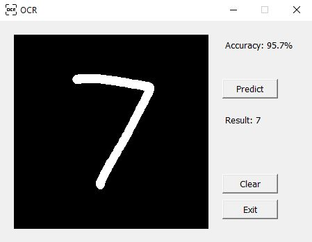

# Custom Optical Character Recognition (OCR) System Using a Scratch-Built Convolutional Neural Network

This application leverages a Convolutional Neural Network (CNN) to predict handwritten digits drawn by the user on an interactive canvas. 
Users can draw a number (from 0 to 9) on the canvas, and the CNN model processes the input image in real-time. After submitting the drawing, 
the app converts the canvas into a format suitable for prediction, rescaling and preprocessing the image before passing it through the trained CNN. 
The model then analyzes the features of the drawing—such as edges, shapes, and textures—through its multiple convolutional layers and predicts the number.

### Key Features:
-  Real-Time Prediction: Upon submission,  the drawing is processed and a prediction is made by the CNN, displaying result instantly
-  Interactive Drawing Canvas: Can freely draw using brush tool, simulating the input for handwritten digit recognition.

### Language and Libraries Used:
-  Language: Python
    -  numpy
    -  pillow(image processing)
    -  tkinter(interactive canvas)
 
### Snipped Images:
-    Frontpage:

-    Setting Hyperparameters:

-    Initialized:

-    Canvas with accuracy:
      -    with correct prediction: 

      -    with wrong prediction: 

This project is designed as an educational endeavor to deepen my understanding of Convolutional Neural Networks (CNNs) by exploring their architecture, functionality, and practical applications in tasks such as image recognition and classification.
